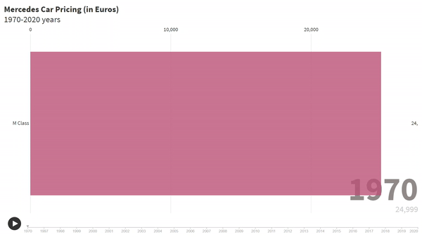
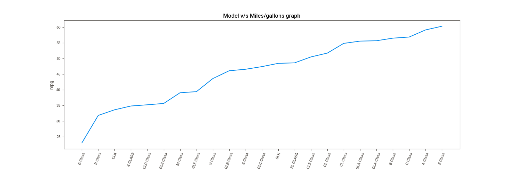
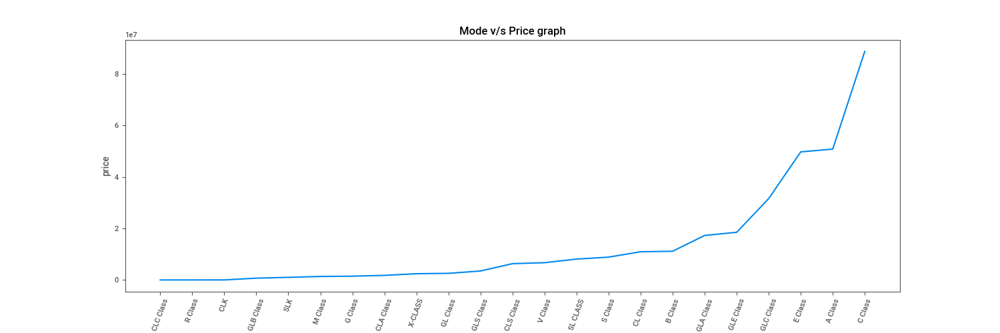
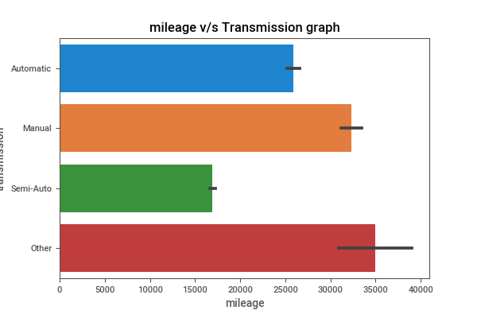
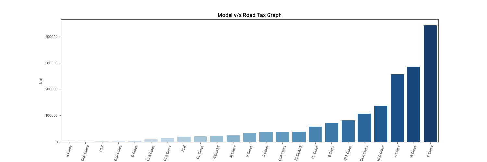
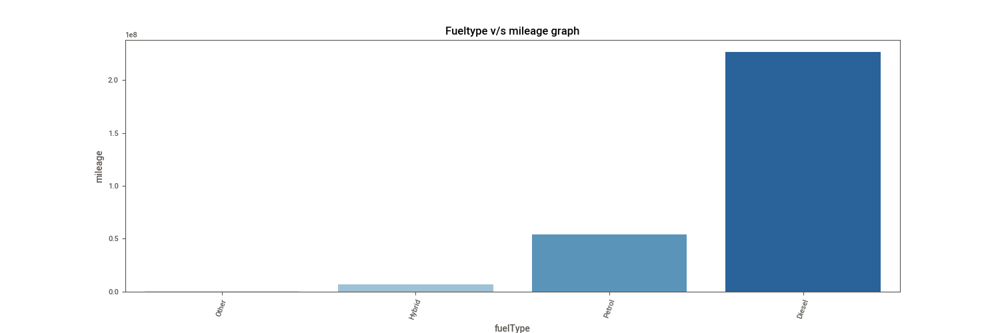

# Exploratory Data Analysis on Mercedes Benz Car Models


[](https://youtu.be/YlBAKiUnp_Q)
<br>

*Click gif to know more* <br>
<br>

This notebook will analyze the important variables which go into determining a Mercedes Benz model automobile. The Exploratory Data Analysis of Mercedes Benz Car Models dataset will be the focus of this notebook. As the name implies, EDA allows us to gain a better understanding of the data. We will study the statistical features of this data, generate visualisations, and test hypotheses throughout this stage.  The notebook will try to answer following Questions from the dataset provided on Kaggle.

<br>
<br>
1.  What is each variable's distribution?<br>
2.  Are there any noticeable outliers? (to be fixed later)<br>
3.  Are the maximum and minimum values for the variables reasonable? Do you see any values that appear to be invalid?<br>
4.  What is the mean of all the variables? What do the means reveal about your entire dataset?<br>
5.  The necessary statistics for analysing a dataset's visual representation.<br>
6.  How to extract vital suggestions to address the business challenge from visuals using an in-depth analysis of metrics. <br>
7.  Which Mercedes Benz car models are efficient based on Mileage , Miles/gallon (mpg) and prices (in Euros)<br>
8.  What are the tax ratings for each Mercedes Benz Car models?<br>
9.  Which car model would be better choice based on fuel-type and mileage.<br>

## Step 0: Install Libraries

``` 
!pip install sweetviz
```

In this step we will be installing required libraries for better comprehension of our dataset. The Exploratory Data Analysis have been performed with the help of Sweetviz library. Sweetviz is an open-source Python package that creates elegant, high-density visuals with just two lines of code to jumpstart EDA (Exploratory Data Analysis). Output is an HTML application that is completely self-contained. 


## **Step 1:** Import Libraries

Importing libraries that are required to analyse desired data deductions, visualisations and implementation of data-driven decision for generating an effective business models.

## **Step 2:**  Read Mercedes Used Car Listing Dataset
``` #Read csv file  and store it into a variable (To provide a file location, upload data to Google Colab or Google Drive. )
carmodels = pd.read_csv(r"/content/merc.csv")
```
<br>

``` #Display of data file in Google Colab  
carmodels
```

## **Step 3:** Analyze Mercedes Used Car Listing Dataset

## 1)    An Overview of Mercedes Used Car Listing Dataset using Sweetviz library

The sub-step incorporates a short overview of the dataset. This specifies specific visuals and statistics to swiftly comprehend data and make efficient data-driven decisions.


[For Overview Analysis click here](analyze.html)

``` #Analyze the entire dataset using 3 lines of code
#Sweetviz library have been imported as sv

analyze_report = sv.analyze(carmodels)
analyze_report.show_html('analyze.html' , open_browser = False)
```

<br>


## 2) The Deduction show


This is an important step in Exploratory data analysis, this step can retrieve the most innovative and intriguing deductions to make data-driven decisions. 

```
carmodels #load the dataset
``` 
<br>

```
carmodels.groupby(['model']).count() #count the number of similar mercedes benz models 
```

##  Visualisations and Analysis

## A) Model v/s Miles per gallon 


## **Insights**

<br>
The objective for using the mean of all data is to show overall performance of automobile models in terms of miles per gallon. We may derive the following assertions from the data provided:
<br>

1.   There are about **15** automobile models that get a higher miles per gallon than the average. <br>
2.   In terms of miles per gallon, the E class vehicle outperforms the G class model by more than **5.4 percent**.  <br>
3. When the miles/gallon mean value is greater, the automobile can drive **further** than when the mean value is lower. <br>
4. It may also be deduced that the mercedes automobile models which are above average value **emits less** carbon dioxide when compared to other models. <br>


## B) Model v/s Mileage 


## Insights 

1.   According to the median of the statistics, more than 11 Mercedes model automobiles had better mileage performance.
2.   However, when compared to the median value of our data, the Mercedes CLK model has approximately **12.51%** higher miles, and altogether, the CLK model delivers **15.67%** mileage to the dataset.
3.  Subsequently, an overall fuel consumption of CLK model is 3265.30 gallons at 33.6 miles per gallon. 
4.  Hence, we can deduce that car models with higher mpg value has following applications 
 - Fuel consumption is reduced.
 - Lower Maintenance Costs


## C)  Model v/s Price 



## D)  Year v/s Price 


## Insights 

<br>

1.   The price graph follows the trend line **y = 1.3 + 2.5x ( x $10^8$)**. <br>
The Least Square Method was used to estimate the trend line. This approach may be used to **forecast** future prices and provide a quick overview of historical sales as well as opportunities for development.
2.  The slope of the trend line is (m) = 2.5, with a positive slope , the sales are growing from left to right. 
3.  From left to right, sales are growing.
However, a price reduction from 2019 to 2020 has a greater influence on company profit margins, since sales of motor manufacturers were halted owing to the pandemic, resulting in a price drop.  <br> *(Mercedes stocks are owned by Daimler AG)*
4. The firm was in a loss of -2.53 % with a volume of 13M to 24M during the severe pandemic, i.e. from 10th January 2020 to 6th November 2020.


## E) Mileage v/s Transmission 



## Insights

<br>

1.  Manual Transmission has the most mileage of the three most recent transmission systems when compared to the other transmission systems.


 - Manual transmissions include more gears and a simpler design, resulting in a lighter transmission system.


 - A simpler design decreases the car's annual fuel consumption and, as a result, the cost of maintenance.


2.   The other category may include the following transmission systems (these are some of the examples of transmission system)


- **Tiptronic Transmission :**
A tiptronic is a type of automatic transmission that allows for fully automatic gear shifting or manual gear shifting by the driver. Tiptronics use a torque converter rather than a clutch.


- **Dual Clutch Transmission (DCT) :**
A dual clutch transmission has two gear shafts with a clutch for each. The dual system allows for faster and smoother gear changes.
<br>

## F) Model v/s Tax





## Insights

<br>

**Road Tax Description**:  <br>
1. It is a tax that must be paid by anybody who purchases a car. The Road Tax is a state-level tax, meaning that it is imposed at the state level by the governments of several states.
2. For charging the road tax, each state has its own set of rules and regulations. The amount of tax varies due to the varied percentages charged by different states. According to the Central Motor Vehicles Act, if a vehicle is operated for more than a year, the entire amount of road tax must be paid at once. <br>

3. Individuals purchasing a vehicle pay the road tax which is based on the ex-showroom price of the vehicle. The calculation of road tax depends on these following things:

  a. Seating capacity of the vehicle <br>
  b. Engine capacity of the vehicle <br>
  c. Age of the vehicle <br>
  d. Weight of the Vehicle <br>
*Note: This is according to Indian Rules and Regulations* <br>
<br>
**Analysis** <br>
1. Although the Mercedes C class has more advanced built-in technology, making the C class interface more user-friendly, it has a far higher road tax than the Mercedes A class, by 9.29 percent.
2. When it comes to miles per gallon and price, an A class vehicle would be a better choice than a C class model.

<br>

## G) Fueltype v/s Mileage





## Insights
<br>
1. For long distance travel, diesel engines are recommended. For those who are Hodophile, Mercedes automobile models with Diesel engines have a 79 percent probability of being their first preference. <br>
2.  Diesel engines are limited for vehicles that have a high frequency of travel, such as trucks, buses, and off-road vehicles, despite having higher efficiency and lower costs than petroleum. Because of the increased green house gases, diesel engines are limited for vehicles that have a high frequency of travel, such as trucks, buses, and off-road vehicles.


#  Conclusion


<br>

The deduction and statistical analysis determined with the full consideration of metrics of Mercedes Model cars using the dataset. The notebook have explored Transmission, Miles/gallon, Mileage and road tax metrics for better comprehension of our dataset.  
<br>
1. For those who want to buy a car for travel or daily use, the miles per gallon number should be greater than 30 mpg.
2. Mileage is another element that influences a vehicle's fuel usage. The cost of maintaining a car is determined by its mileage.
3. Manual transmissions have more gears and a simpler design, making them lighter.
4. Diesel engines are restricted for vehicles that travel often, such as trucks, buses, and off-road vehicles, due to higher greenhouse gas emissions.

